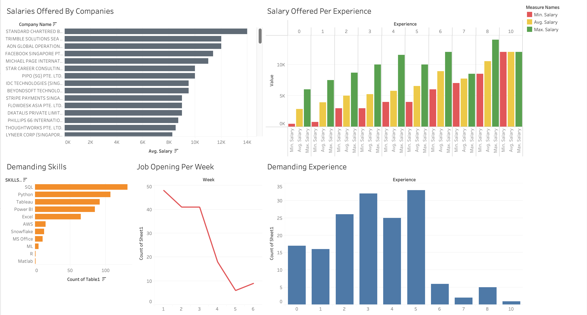

# 📈 Data Analyst Job Market Analysis – Singapore (6-Week Study)

This project analyzes Data Analyst job vacancies in Singapore over a span of **6 weeks**. The goal is to extract actionable insights about the job market using Excel dashboards, SQL queries, and Tableau visualizations.

---

---

## 🧠 Objective

- Identify **most in-demand skills**
- Understand **salary ranges by experience level**
- Observe **weekly hiring trends**
- Rank companies by **average offered salary**
- Segment job listings by **experience level and frequency**

---

## 🔧 Tools & Technologies

| Tool      | Purpose                                       |
|-----------|-----------------------------------------------|
| **Excel** | Pivot tables, visual dashboards               |
| **SQL**   | Data cleaning, querying, transformation       |
| **Tableau** | Interactive dashboard with drill-down views |

---

## 📊 Methodology

### 📁 Data
- Collected and compiled manually over 6 weeks
- Fields include: `Company Name`, `Job Title`, `Skills`, `Salary`, `Experience`, `Week`

### 🧹 Data Cleaning (via SQL)
- Converted `Experience` field from strings to integers, replacing "Intern" with NULL then backfilled
- Split comma-separated `Skills` into individual rows using a recursive CTE
- Normalized data types for consistency (e.g., `VARCHAR`, `INT`)

### 📈 Analysis Performed
- **Experience-wise Vacancy Count**  
  Tracked how job openings vary with years of experience

- **Skill Frequency Analysis**  
  Used recursive SQL to split and count individual skills across listings

- **Experience vs Salary Breakdown**  
  Aggregated average, max, and min salary by experience level

- **Company-wise Salary Analysis**  
  Ranked companies by average salary offered

- **Weekly Posting Trends**  
  Job counts grouped by week for hiring trend analysis

---

## 📘 SQL Highlights

''''
-- Skill Frequency Count
WITH RECURSIVE split_skills AS (
    SELECT `COMPANY NAME`, `EXPERIENCE`,
           SUBSTRING_INDEX(`SKILLS`, ',', 1) AS skill,
           SUBSTRING(`SKILLS`, LENGTH(SUBSTRING_INDEX(`SKILLS`, ',', 1)) + 2) AS remaining
    FROM sg_companies
    UNION ALL
    SELECT `COMPANY NAME`, `EXPERIENCE`,
           SUBSTRING_INDEX(remaining, ',', 1),
           SUBSTRING(remaining, LENGTH(SUBSTRING_INDEX(remaining, ',', 1)) + 2)
    FROM split_skills
    WHERE remaining != ''
)
SELECT TRIM(skill) AS SKILL, COUNT(*) AS COUNT
FROM split_skills
GROUP BY TRIM(skill)
ORDER BY COUNT DESC;
''''
---

## 📊 Visual Dashboards

### 🔹 Excel Dashboard

* Pivot charts for experience and skill frequency
* Bar graphs for salary analysis
* Filter-enabled views for slicing by company or week

---

## 💡 Key Insights

* **SQL, Excel, Python, and Power BI** are the top in-demand skills
* Most job listings target candidates with **0–2 years of experience**
* **Internships** are less frequent and typically unpaid or lower-paying
* Certain companies consistently offer **above-average salaries**
* Week 3 showed the **highest spike** in job listings

---
