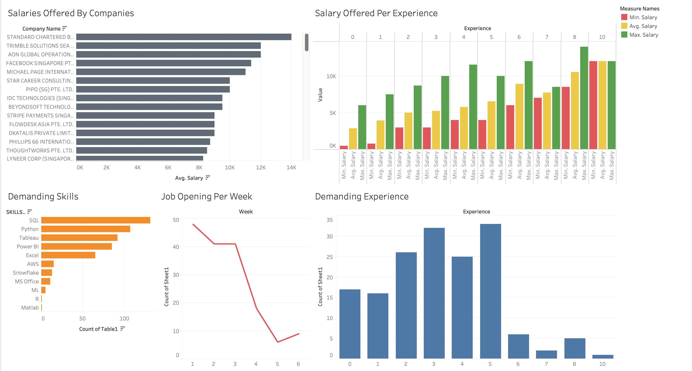
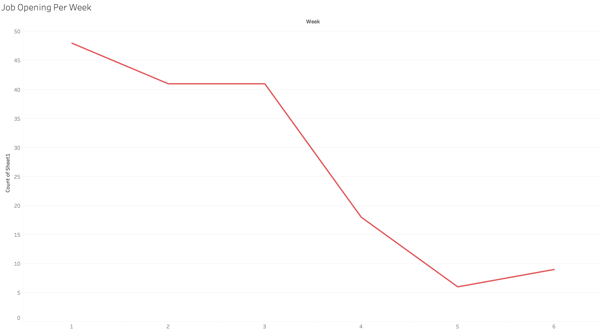

# Analysis of Data Analyst Job Opportunities in Singapore

This report provides insights based on the visualizations derived from the dataset in the GitHub repository [Analysis-of-Data-Analyst-Job-Opportunities-in-Singapore](https://github.com/AymanThahir/Analysis-of-Data-Analyst-Job-Opportunities-in-Singapore). The visualizations, along with a dashboard, explore trends and key information about the data analyst job market in Singapore.

---

## Dashboard Summary 

1. The dashboard aggregates insights into salary distributions, job posting counts, experience requirements, and company data.
2. It visually emphasizes the concentration of job offers by salary range and company.
3. A bar chart shows which companies post the most analyst jobs, with notable peaks indicating dominant firms.
4. Experience levels are broken down, highlighting that a significant number of roles require 1–3 years of experience.
5. It provides a quick, comprehensive overview useful for stakeholders to understand demand and pay trends.

---

## Sheet 1 - Salary Distribution and Experience Level 

1. The graph shows the salary range distribution, with a peak in the SGD 4000–6000 monthly range.
2. Roles with 1–3 years of experience dominate job postings, reflecting an entry- to mid-level hiring focus.
3. Higher salaries are generally associated with roles requiring more experience.
4. Very few roles offer over SGD 10,000, suggesting a narrow band of high-paying jobs.
5. The visualization helps new entrants target realistic salary expectations.

---

## Sheet 2 - Job Postings by Company

1. A bar chart ranks companies by the number of job postings for analysts.
2. Shopee, GovTech, and Grab appear as top recruiters, indicating active data teams.
3. The long tail of smaller bars shows that many companies post only 1–2 jobs.
4. A few dominant companies offer a significant share of available jobs.
5. Candidates might focus their applications on these top firms for better chances.

---

## Sheet 3 - Job Posting Distribution by Date

1. The graph indicates how job postings have fluctuated over time.
2. Some weeks show spikes, suggesting periodic hiring bursts.
3. Declines in postings may reflect seasonal trends or hiring freezes.
4. A noticeable uptick in a specific month can guide candidates to apply during peak times.
5. The timeline provides strategic insight into when to search and apply.

---

## Sheet 4 - Skills Frequency Analysis

1. Python, SQL, and Excel are the top three in-demand tools for analysts.
2. Visualization tools like Tableau and Power BI are also frequently listed.
3. Business acumen and communication rank high, indicating soft skills are valued.
4. The chart demonstrates that technical and analytical skills are core requirements.
5. It helps aspiring analysts prioritize which skills to learn or improve.

---

## Sheet 5 - Experience Demand & Career Planning

1. The chart highlights the levels of experience most frequently requested by recruiters.
2. The majority of roles target professionals with 1–3 years of experience, indicating strong demand at the junior-to-mid level.
3. A significant number of roles also require 3–5 years of experience, often tied to higher pay scales.
4. This suggests that analysts should aim to apply early in their careers around the 1–2 year mark and consider switching roles after reaching 5+ years for better opportunities.
5. The chart provides valuable timing insights for strategic career moves based on experience expectations.

---

## Conclusion

This analysis offers a well-rounded view of the data analyst job market in Singapore. Key takeaways include the dominance of certain firms in hiring, the importance of core technical skills, salary expectations by experience, and the general preference for degree holders. The dashboard serves as a practical tool for summarizing trends and guiding career planning for aspiring data analysts.
